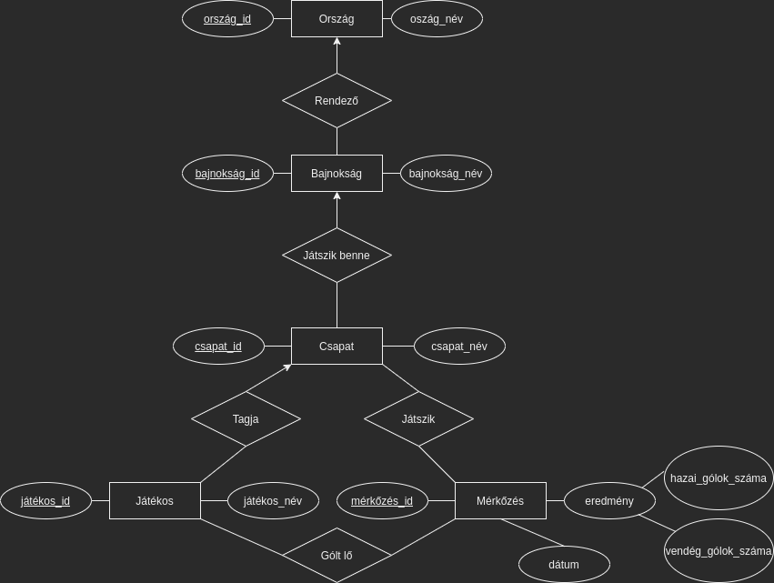
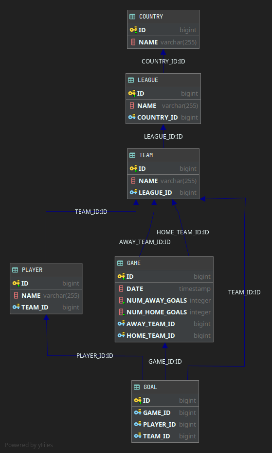

# Csapatsportok

>A kötelező program témája a csapatsportok. Kulcsszavai a 'csapatok', 'versenyzők', 'mérkőzések', 
>'pontszerzők/góllövők'. Az adatbázis futball meccsek adatait tárolja. 
>Segítségével egy olyan alkalmazás lesz megvalósítva, amely megjeleníti a tárolt országok, ligák, 
>csapatok, mérkőzések adatait, a játékosokhoz és a meccsekhez tartozó adatokkal, többek között 
>a meccsek gólszerzőit. Ezen felül módosítani, új adatot felvinni, a már meglévőket módosítani 
>is lehet grafikus felületen.
---


#### EGYED-KAPCSOLAT MODELL




#### RELÁCIÓS ADATBÁZISSÉMA

> Jelölés:  
> Kulcs: **félkövér**  
> Külső kulcs: *dőlt*  

Orszag (**orszag_id**, orszag_nev)  
Bajnoksag (**bajn   oksag_id**, bajnoksag_nev, *orszag_id*)  
Csapat (**csapat_id**, csapat_nev, *bajnoksag_id*)  
Jatekos (**jatekos_id**, jatekos_nev, *csapat_id*)  
Merkozes (**merkozes_id**, *hazai_csapat_id*, hazai_golok_szama, *vendeg_csapat_id*, vendeg_golok_szama, datum)  
Gol (**gol_id**, *jatekos_id*, *merkozes_id*, *csapat_id*) 


#### NORMALIZÁLÁS

1. Normálforma: A Mérkőzés összetett attribútuma helyettesítve lett részattribútumaival.
2. Normálforma: Minden másodlagos attribútum teljesen függ a kulcstól.
3. Normálforma: Az attribútumok között nincs tranzitív függés, kivéve a Mérkőzés esetében, 
( {hazai_csapat_id, vendeg_csapat_id, datum} -> {hazai_golok_szama, vendeg_golok_szama} ) 
itt indokoltnak találtam 2NF-ben hagyni a táblát, mert ezeket az adatokat mindig egyben kell 
kezelni, és szükségtelen komplexitásnak láttam szétválasztani a táblát, hogy aztán minden 
lekérdezésben össze kelljen őket kapcsolni.


#### ADATBÁZIS DIAGRAM



#### MEGVALÓSÍTÁSI KÖRNYEZET

A program Java nyelven íródott, MySQL adatbázisra épülve, Spring Boot keretrendszerben.
Webes alkalmazás, böngészőben használható, a SpringBoot által nyújtott TomCat szerveren fut.
Ebből fakadóan a megjelenítés HTML/CSS. A dinamikus HTML kezelésre Thymeleaf-et, 
a megjelenítéshez Bootstrap-et, az adatbázissal való kommunikációra 
a triviálisabb lekérdezések esetén Hibernate-et, a bonyolultabb lekérdezések esetén JDBC-t 
használtam, natív SQL parancsokkal.
Az adatok generálására főleg mockaroo.com által nyújtott szolgáltatásokat vettem igénybe. 
Ezen felül saját programrészeket is felhasználtam, ahol szükséges volt valamilyen bonyolultabb 
logika által generálni adatot. 
(Például a GOAL tábla gólszerző-csapat-meccs véletlenszerű, de helyes generálása) 
Ezt a programba írt Java-SQL kóddal töltöttem fel in-memory adatbázisba,
(H2, amit a végsőkig használtam, mielőtt a végleges MySQL DB-re migráltam) 
onnan SQL dump-pal gyűjtöttem ki az INSERT INTO parancsokat.
A data.sql fájlban találhatóak a kezdeti adatok.
A táblákat a Java objectekből JPA-vel generáltam, minden konfigurációt a domain/-en belüli
osztályokban, JPA annotációkkal végeztem. A végleges adatbázis szerkezet dumpja a 
schema.sql-ben található.
A program futtatása a scoretable.jar fájl indításával lehetséges.
{**TODO**: actual command ide}```$ java -jar target/myapplication-0.0.1-SNAPSHOT.jar```  
A szerver a 8080 porton indul.
{**TODO**: kapcsolódás sql-hez, egyéb setup dolgok}.


#### A PROGRAM SZOLGÁLTATÁSAI

##### Adatbázisban lévő adatok kilistázása
A főoldalon az adatbázisban szereplő országok, és azokban rendezett ligák találhatóak.
A ligák egyikére kattintva részletesebb információkat kapunk róluk. Ezek a résztvevő 
csapatok, a tabella jelenlegi állása, a lejátszott meccsek információi, góllövőlista, 
és a legnagyobb arányú győzelmekről egy összesítő táblázat érdekességképpen. 
A felső menüsorban található linkek mind egyre az összes liga, csapat, játékos, meccs, 
és gól információt listázó oldalra vezetnek. Itt lehetőségünk van keresni az adathalmazban, 
illetve azt különböző oszlopok szerint csoportosítani. Itt van lehetősége a belépett 
felhasználónak a sorok melletti gombok használatával az adatok módosítására, illetve 
törlésére. Nem megfelelő utasításokkal az adattáblák nem módosíthatóak, 
az applikáció hibaüzenetet jelenít meg.

##### Admin felület


#### NEMTRIVIÁLIS LEKÉRDEZÉSEK
```SQL
/* 1. MECCS INFO, LIGA NÉV ALAPJÁN, DÁTUM SZERINT NÖVEKVŐ SORRENDBEN */  

SELECT
    HOME.NAME AS HOME_TEAM, 
    AWAY.NAME AS AWAY_TEAM,
    CONCAT(G.NUM_HOME_GOALS, '-', G.NUM_AWAY_GOALS) AS SCORE,
    G.DATE as DATE
FROM GAME AS G
LEFT JOIN TEAM AS AWAY
    ON AWAY.ID = G.AWAY_TEAM_ID
LEFT JOIN TEAM AS HOME
    ON HOME.ID = G.HOME_TEAM_ID
WHERE 
    HOME_TEAM_ID IN (
        SELECT T.ID
        FROM TEAM AS T
        WHERE T.LEAGUE_ID = (
            SELECT L.ID 
            FROM LEAGUE AS L 
            WHERE L.NAME LIKE '%Indonesia%'
        )
    )
ORDER BY G.DATE;

/*
                               RESULT

| HOME_TEAM          | AWAY_TEAM           | SCORE | DATE                |
|--------------------|---------------------|-------|---------------------|
| Indonesian Falcons | Indonesian Spiders  | 1-2   | 2020-08-25 00:03:39 |
| Indonesian Spiders | Indonesian Falcons  | 1-0   | 2020-08-27 10:46:25 |
| Indonesian Falcons | Indonesian Stingers | 2-1   | 2020-09-11 08:23:06 |
                                ...
*/


/* 2. LIGA TÁBLA, LIGA NÉV ALAPJÁN: CSAPAT NÉV, LEJÁTSZOTT MECCSEK SZÁMA, LŐTT  
GÓL, KAPOTT GÓL, GÓLKÜLÖNBSÉG, SZERZETT PONTOK, PONT SZERINT CSÖKKENŐ SORRENDBEN */

SELECT
    TEAM,
    COUNT(TEAM) AS P,
    SUM(GOALS_FOR) AS GF,
    SUM(GOALS_AGAINST) AS GA,
    SUM(GOAL_DIFFERENCE) AS GD,
    SUM(POINTS) AS PTS
FROM (
    SELECT
        HOME_TEAM AS TEAM,
        HOME_POINTS AS POINTS,
        HOME_GOALS_FOR AS GOALS_FOR,
        HOME_GOALS_AGAINST AS GOALS_AGAINST,
        (HOME_GOALS_FOR - HOME_GOALS_AGAINST) AS GOAL_DIFFERENCE
    FROM (
        SELECT
            HOME.NAME AS HOME_TEAM,
            CASE
                WHEN G.NUM_HOME_GOALS > G.NUM_AWAY_GOALS THEN 3
                WHEN G.NUM_HOME_GOALS < G.NUM_AWAY_GOALS THEN 0
                ELSE 1
            END AS HOME_POINTS,
            G.NUM_HOME_GOALS AS HOME_GOALS_FOR,
            G.NUM_AWAY_GOALS AS HOME_GOALS_AGAINST
        FROM GAME AS G
        LEFT JOIN TEAM AS AWAY
            ON AWAY.ID = G.AWAY_TEAM_ID
        LEFT JOIN TEAM AS HOME
            ON HOME.ID = G.HOME_TEAM_ID
        WHERE HOME.ID IN (
                SELECT T.ID
                FROM TEAM AS T
                WHERE T.LEAGUE_ID = (
                    SELECT L.ID
                    FROM LEAGUE AS L
                    WHERE L.name LIKE '%Major%'
                )
        )
    ) as HOME_RESULTS
              
    UNION ALL
              
    SELECT
        AWAY_TEAM AS TEAM,
        AWAY_POINTS AS POINTS,
        AWAY_GOALS_FOR AS GOALS_FOR,
        AWAY_GOALS_AGAINST AS GOALS_AGAINST,
        (AWAY_GOALS_FOR - AWAY_GOALS_AGAINST) AS GOAL_DIFFERENCE
    FROM (
        SELECT
            AWAY.NAME AS AWAY_TEAM,
            CASE
                WHEN G.NUM_HOME_GOALS < G.NUM_AWAY_GOALS THEN 3
                WHEN G.NUM_HOME_GOALS > G.NUM_AWAY_GOALS THEN 0
                ELSE 1
            END AS AWAY_POINTS,
            G.NUM_AWAY_GOALS AS AWAY_GOALS_FOR,
            G.NUM_HOME_GOALS AS AWAY_GOALS_AGAINST
        FROM GAME AS G
        LEFT JOIN TEAM AS AWAY
            ON AWAY.ID = G.AWAY_TEAM_ID
        LEFT JOIN TEAM AS HOME
            ON HOME.ID = G.HOME_TEAM_ID
        WHERE HOME.ID IN (
                SELECT T.ID
                FROM TEAM AS T
                WHERE T.LEAGUE_ID = (
                    SELECT L.ID
                    FROM LEAGUE AS L
                    WHERE L.name LIKE '%Major%'
                )
        )
    ) AS AWAY_RESULTS
) AS TOTAL_RESULTS
GROUP BY TEAM
ORDER BY PTS DESC, GD DESC;

/*
                          RESULT

| TEAM              | P   | GF   | GA   | GD   | PTS   |
|-------------------|-----|------|------|------|-------|
| American Stingers | 14  | 20   | 12   | 8    | 26    |
| American Chuckers | 14  | 19   | 13   | 6    | 22    |
| American Kickers  | 15  | 21   | 9    | 12   | 21    |
| American Ninjas   | 14  | 12   | 14   | -2   | 17    |
| American United   | 14  | 13   | 19   | -6   | 17    |
| American Fighters | 14  | 14   | 14   | 0    | 16    |
| American Geckos   | 14  | 8    | 14   | -6   | 15    |
| American Rockets  | 15  | 14   | 26   | -12  | 15    |
|------------------------------------------------------|

*/


/* 3. TOP 10 GÓLLÖVŐLISTA, LIGA NÉV ALAPJÁN */

SELECT
    PLAYER.NAME AS PLAYER_NAME,
    TEAM.NAME AS TEAM_NAME,
    COUNT(*) AS NUM_GOALS
FROM GOAL
LEFT JOIN PLAYER
    ON GOAL.PLAYER_ID = PLAYER.ID
LEFT JOIN TEAM
    ON TEAM.ID = PLAYER.TEAM_ID
LEFT JOIN LEAGUE
    ON LEAGUE.ID = TEAM.LEAGUE_ID
WHERE
    LEAGUE.ID = (
    SELECT L.ID
    FROM LEAGUE AS L
    WHERE L.NAME LIKE '%Czech%'
)
GROUP BY PLAYER_ID
ORDER BY NUM_GOALS DESC
LIMIT 10;

/*                      RESULT     
        
| PLAYER_NAME           | TEAM_NAME        | NUM_GOALS   |
|-----------------------|------------------|-------------|
| Chandra Abrahamowitcz | Czech Wasps      | 5           |
| Torie Muir            | Czech Flying     | 4           |
| Roselin Wilby         | Czech Legends    | 4           |
| Quentin Soeiro        | Czech Busters    | 3           |
| Audi Maxsted          | Czech Kickers    | 3           |
| Halli Maker           | Czech Flying     | 3           |
| Reuben Goldsbrough    | Czech Hurricanes | 3           |
| Missy Milley          | Czech Legends    | 2           |
| Tuck Martellini       | Czech Hurricanes | 2           |
| Bill Gallety          | Czech Sharks     | 2           |
|--------------------------------------------------------|

*/


/* 4. TOP 10 LEGNAGYOBB ARANYÚ GYŐZELEMRŐL INFO, LIGA NÉV ALAPJÁN */

SELECT
    HOME.NAME AS HOME_TEAM,
    AWAY.NAME AS AWAY_TEAM,
    CONCAT(G.NUM_HOME_GOALS, '-', G.NUM_AWAY_GOALS) AS SCORE,
    ABS(G.NUM_AWAY_GOALS - G.NUM_HOME_GOALS)  AS DIFFERENCE,
    G.DATE AS DATE
FROM GAME AS G
LEFT JOIN TEAM AS AWAY
    ON AWAY.ID = G.AWAY_TEAM_ID
LEFT JOIN TEAM AS HOME
    ON HOME.ID = G.HOME_TEAM_ID
LEFT JOIN LEAGUE AS L
    ON HOME.LEAGUE_ID = L.ID
 WHERE L.ID = (
    SELECT L.ID
    FROM LEAGUE AS L
    WHERE L.NAME LIKE '%Czech%'
)
ORDER BY DIFFERENCE DESC
LIMIT 10;

/*
                                          RESULT

| HOME_TEAM         | AWAY_TEAM             | SCORE   | DIFFERENCE   | DATE                |
|-------------------|-----------------------|---------|--------------|---------------------|
| Czech Busters     | Czech Legends         | 5-0     | 5            | 2020-12-06 11:22:11 |
| Tanzanian Bombers | Tanzanian Tornadoes   | 4-0     | 4            | 2020-12-08 00:39:08 |
| American Stingers | American Geckos       | 4-0     | 4            | 2020-11-10 14:41:44 |
| Czech Sharks      | Czech Sonics          | 4-1     | 3            | 2020-12-14 16:06:08 |
| American Fighters | American Rockets      | 3-0     | 3            | 2020-09-22 05:49:56 |
| American Fighters | American Stingers     | 0-3     | 3            | 2020-11-09 01:39:56 |
| American Kickers  | American United       | 3-0     | 3            | 2020-11-21 16:00:49 |
| Russian Flying    | Russian Sharpshooters | 3-0     | 3            | 2020-12-15 16:52:01 |
| American Kickers  | American Stingers     | 3-0     | 3            | 2020-10-21 18:36:39 |
| Czech Legends     | Czech Wasps           | 4-1     | 3            | 2020-12-30 22:33:04 |
|-------------------|-----------------------|---------|--------------|---------------------|
*/
```