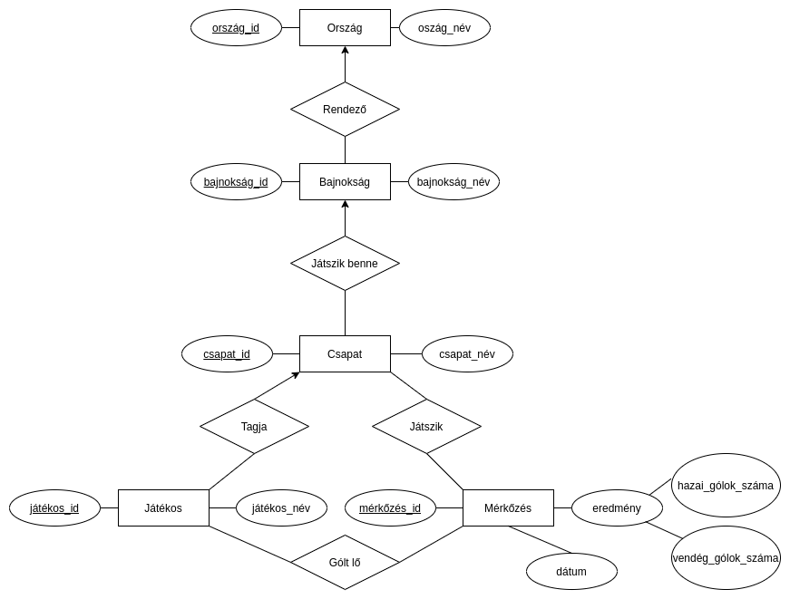

# Csapatsportok

> A projekt témája a csapatsportok. Az elkészített applikáció futball mérkőzésekkel kapcsolatos adatokat tartalmaz.  
> A következő kulcsszavak mind implementálásra kerültek a programban: csapatok, játékosok, mérkőzések, góllövők. 
> Ezen felül országokat is támogat a projekt, egy országon belül több ligát is tárolva. 
> A program jelenleg egy szezonon belüli, belföldi mérkőzéseket tárol. Az alkalmazás egy webes felületen,
> keresztül nyújt lehetőséget a felhasználónak a különböző adatok kilistázására, és űrlapokon 
> adatok módosítására, törlésére, új adat felvitelére (az adatbázis integritásának megőrzése mellett). 
> Jelenleg nincs autentikációhoz kötve az ilyen jellegű adatmódosítás, viszont a több szinten 
> (adatbázis, backend, frontend) implementált integritás ellenőrzés miatt, nincs lehetőség az 
> adatbázis integritását elrontani.  

---

#### EGYED-KAPCSOLAT MODELL




#### RELÁCIÓS ADATBÁZISSÉMA

> Jelölés:  
> Kulcs: **félkövér**  
> Külső kulcs: *dőlt*  

##### Az adatokkal való munka megkönnyítése végett, minden entitásnak van egy egyedi azonosítója.

Orszag (**orszag_id**, orszag_nev)  
Bajnoksag (**bajn   oksag_id**, bajnoksag_nev, *orszag_id*)  
Csapat (**csapat_id**, csapat_nev, *bajnoksag_id*)  
Jatekos (**jatekos_id**, jatekos_nev, *csapat_id*)  
Merkozes (**merkozes_id**, *hazai_csapat_id*, hazai_golok_szama, *vendeg_csapat_id*, vendeg_golok_szama, datum)  
Gol (**gol_id**, *jatekos_id*, *merkozes_id*, *csapat_id*) 


#### NORMALIZÁLÁS

1. Normálforma: A **Mérkőzés** összetett attribútuma helyettesítve lett részattribútumaival.
2. Normálforma: Minden másodlagos attribútum teljesen függ a kulcstól.
3. Normálforma: Az attribútumok között nincs tranzitív függés.

#### ADATBÁZIS DIAGRAM


#### MEGVALÓSÍTÁSI KÖRNYEZET

A program a fejlesztés alatt H2 adatbázist használt a könnyebb tesztelhetőség végett, ez a jelenlegi 
bemutató verzióban egy távoli, Herokun hosztolt MySQL adatbázisra lett cserélve. Alapja egy Spring Boot
webapplikáció, Java nyelven, annak a 15-ös verziójával, TomCat webszerverrel. A frontend ennek fényében HTML/CSS. 
A dinamikus adat megjelenítést, és form feldolgozást Thymeleaffel végeztem. Felhasznált könyvtárak még 
a Bootstrap, JQuery, és egy Bootstrap-Select nevű JQuery plugin, ami a legördülő menükben való keresést 
könnyíti meg. A frontenden végzett adat validáció a HTML oldalakban található, magában a formban tagenként és 
JavaScript, illetve JQuery felhasználásával készült szkriptekként. Hibernate ORM fut a backenden, az adattáblák 
konfigurációja ezért majdnem teljes egészében Java kódból, Hibernate annotációkkal történt. A triviális 
lekérdezéseket a Spring Data által nyújtott CrudRepository interfacek oldják meg, ezek generálnak 
végül SQL-t. Az összetett lekérdezésekre Spring JDBC-vel implementált, natív SQL lekérdezések lettek 
használva. Az adatbázis feltöltése túlnyomórészt a mockaroo.com által nyújtott szolgáltatásokkal zajlott.
A bonyolultabb logikát megkövetelő adatot végül a már feltöltött adatok segítségével, a programban 
implementált kóddal generáltam, és töltöttem fel az adatbázisba. Ilyen például a Goal tábla, ahol 
szükséges volt minden, normál eloszlást követő, de véletlenszerűen generált mérkőzés eredményhez 
gólszerzőt társítani. Jelenlegi formájában az applikáció nem támogat öngól szerzést, csak a gólt szerző 
csapatban játszó játékos nevéhez köthető a pontszerzés, így egy véletlenszerűen választott játékosához 
van rendelve minden meccs minden csapatának minden gólja. A távoli adatbázison, ugyanúgy, mint az 
in-memory, H2 adatbázison is, a sémák kialakítását a program a Hibernate-n keresztül végezte a 
konfiguráció alapján. A sémák azoknak kialakításakor logolva lettek. A schema.sql tartalmazza ezeket. 
A végső adatbázis feltöltése a fejlesztés alatt már kialakított adatbázisból dumpolt adatokkal történt. 
A data.sql tartalmazza ezeket. 
A program a `www.score-table-webapp.herokuapp.com` címen fut, a saját adatbázisával. 
Azonos verzió futtatható (ami szintén ezen az oldalon futó adatbázisra kapcsolódik) a csomagolt 
jar fájl futtatásával: ```java -jar target/myapplication-0.0.1-SNAPSHOT.jar```. 
A szerver a 8080 porton indul, a `localhost:8080` URL-en érhető el ebben az esetben.

#### A PROGRAM SZOLGÁLTATÁSAI

##### Adatbázisban lévő adatok kilistázása
A főoldal az országok listájához visz minket, ahol táblázatban szerepelnek a már felvitt 
országok, illetve az azokban megrendezett bajnokságok. A bajnokságok linkek, részletes 
információt nyújtó oldalra navigál minket. Ugyanez a funkció elérhető a felső navigációs 
sávban, a Leagues legördülő menüben (illetve a többi nézet is innen érhető el). 
Ez a legrészletesebb megjelenítést tartalmazó oldal. 
Itt megtekeinthetjük a résztvevő csapatokat, a lejátszott mérkőzéseket, egy top 10-es 
góllövőlistát, illetve a legnagyobb különbséggel zárult meccseket. Ezen felül természetesen 
a bajnokság jelenlegi állását mutató tabella is itt szerepel, ahol lőtt gólók, kapott 
gólok, gólkülönbség, lejátszott meccsek száma, és a gyűjtött pontok összege szerepel. 
Az All Leagues fül a legördülő menü alján, illetve a Teams, Players, Games, Goals link a 
navigációs sávban mind a saját adattáblához társított nézethez navigál, ahogy a Countries is.

##### Adatbázisban lévő adatok módosítása, törlése, új adat felvitele
Az egy-egy specifikus bajnokság adatait tartalmazó nézeteken kívül mindenhol a megfelelő gombokkal 
tud a felhasználó módosítani, törölni, vagy új adatot felvinni a megfelelő táblába. 
Meglévő adat módosítása esetén csak az adat integritást el nem rontó műveletek hajthatók végre.
Törlés esetén egy kivételével minden esetben a kapcsolódó adatok is törlésre kerülnek. 
(például: egy ország törlésével törlődnek az országban rendezett bajnokságok, azokban a 
bajnokságokban résztvevő csapatok, a köztük lezajlott mérkőzések, illetve azokon a mérkőzéseken 
esett gólok is). Az egy kivétel a játékosokat tároló tábla. Egyedül itt nem veszti értelmét a 
további tárolás, így a törölt csapatok játékosainak csapata automatikusan null értékre állítódik. 
A nézetben ez Free Agent néven jelenik meg a Players fül alatt, a játékos Team oszlopában. 
Ezeknek a játékosoknak lehetőségünk van új csapatot kiválasztani. Ha egy játékosnak van beállított csapata, 
akkor azt módosítani nem tudjuk (Nincs átigazolási időszak, de szabadúszót igazolni lehet, 
így abban az esetben módosítható). Új ország felvitelekor annak nincsenek tárolt bajnokságai, mint 
ahogy új bajnokság létrehozásakor annak nincsenek mentett csapatai, csapatnak játékosai. Ezeket egymás 
után kell felvinni, beállítani. Egy új mérkőzés létrehozásakor az automatikusan 0-0 eredménnyel tárolódik. 
Ahhoz, hogy módosítsuk ezt, gólokat kell felvinni, a megfelelő meccset, csapatot, és játékos kiválasztva. 
Gól törlése esetén az erdemény is változik, amit minden táblán nyomon követhetünk. Ezeknek a korlátozásoknak 
hála nincs lehetőség érvénytelen adat felvitelére.


#### NEMTRIVIÁLIS LEKÉRDEZÉSEK
Az itt szereplő lekérdezések egy-egy példát mutatnak be, a programkódban 
ezek szinte ugyanígy, de dinamikusan behelyettesíthető módon szerepelnek. 

```SQL
/* 

    1. MECCS INFO, LIGA NÉV ALAPJÁN, DÁTUM SZERINT NÖVEKVŐ SORRENDBEN 
    Implementálva: MatchInfoRepository. Nézet: specifikus bajnokság adatai 

*/  

SELECT
    HOME.NAME AS HOME_TEAM, 
    AWAY.NAME AS AWAY_TEAM,
    CONCAT(G.NUM_HOME_GOALS, '-', G.NUM_AWAY_GOALS) AS SCORE,
    G.DATE as DATE
FROM GAME AS G
LEFT JOIN TEAM AS AWAY
    ON AWAY.ID = G.AWAY_TEAM_ID
LEFT JOIN TEAM AS HOME
    ON HOME.ID = G.HOME_TEAM_ID
WHERE 
    HOME_TEAM_ID IN (
        SELECT T.ID
        FROM TEAM AS T
        WHERE T.LEAGUE_ID = (
            SELECT L.ID 
            FROM LEAGUE AS L 
            WHERE L.NAME LIKE '%Indonesia%'
        )
    )
ORDER BY G.DATE;

/*
                               RESULT

| HOME_TEAM          | AWAY_TEAM           | SCORE | DATE                |
|--------------------|---------------------|-------|---------------------|
| Indonesian Falcons | Indonesian Spiders  | 1-2   | 2020-08-25 00:03:39 |
| Indonesian Spiders | Indonesian Falcons  | 1-0   | 2020-08-27 10:46:25 |
| Indonesian Falcons | Indonesian Stingers | 2-1   | 2020-09-11 08:23:06 |
                                ...
*/


/* 

    2. BAJNOKSÁG TABELLE, BAJNOKSÁG NÉV ALAPJÁN: CSAPAT NÉV, LEJÁTSZOTT MECCSEK SZÁMA, 
    LŐTT GÓL, KAPOTT GÓL, GÓLKÜLÖNBSÉG, SZERZETT PONTOK, PONT SZERINT CSÖKKENŐ SORRENDBEN 
    Implementálva: TableInfoRepository. Nézet: specifikus bajnokság adatai 

*/

SELECT
    TEAM,
    COUNT(TEAM) AS P,
    SUM(GOALS_FOR) AS GF,
    SUM(GOALS_AGAINST) AS GA,
    SUM(GOAL_DIFFERENCE) AS GD,
    SUM(POINTS) AS PTS
FROM (
    SELECT
        HOME_TEAM AS TEAM,
        HOME_POINTS AS POINTS,
        HOME_GOALS_FOR AS GOALS_FOR,
        HOME_GOALS_AGAINST AS GOALS_AGAINST,
        (HOME_GOALS_FOR - HOME_GOALS_AGAINST) AS GOAL_DIFFERENCE
    FROM (
        SELECT
            HOME.NAME AS HOME_TEAM,
            CASE
                WHEN G.NUM_HOME_GOALS > G.NUM_AWAY_GOALS THEN 3
                WHEN G.NUM_HOME_GOALS < G.NUM_AWAY_GOALS THEN 0
                ELSE 1
            END AS HOME_POINTS,
            G.NUM_HOME_GOALS AS HOME_GOALS_FOR,
            G.NUM_AWAY_GOALS AS HOME_GOALS_AGAINST
        FROM GAME AS G
        LEFT JOIN TEAM AS AWAY
            ON AWAY.ID = G.AWAY_TEAM_ID
        LEFT JOIN TEAM AS HOME
            ON HOME.ID = G.HOME_TEAM_ID
        WHERE HOME.ID IN (
                SELECT T.ID
                FROM TEAM AS T
                WHERE T.LEAGUE_ID = (
                    SELECT L.ID
                    FROM LEAGUE AS L
                    WHERE L.name LIKE '%Major%'
                )
        )
    ) as HOME_RESULTS
              
    UNION ALL
              
    SELECT
        AWAY_TEAM AS TEAM,
        AWAY_POINTS AS POINTS,
        AWAY_GOALS_FOR AS GOALS_FOR,
        AWAY_GOALS_AGAINST AS GOALS_AGAINST,
        (AWAY_GOALS_FOR - AWAY_GOALS_AGAINST) AS GOAL_DIFFERENCE
    FROM (
        SELECT
            AWAY.NAME AS AWAY_TEAM,
            CASE
                WHEN G.NUM_HOME_GOALS < G.NUM_AWAY_GOALS THEN 3
                WHEN G.NUM_HOME_GOALS > G.NUM_AWAY_GOALS THEN 0
                ELSE 1
            END AS AWAY_POINTS,
            G.NUM_AWAY_GOALS AS AWAY_GOALS_FOR,
            G.NUM_HOME_GOALS AS AWAY_GOALS_AGAINST
        FROM GAME AS G
        LEFT JOIN TEAM AS AWAY
            ON AWAY.ID = G.AWAY_TEAM_ID
        LEFT JOIN TEAM AS HOME
            ON HOME.ID = G.HOME_TEAM_ID
        WHERE HOME.ID IN (
                SELECT T.ID
                FROM TEAM AS T
                WHERE T.LEAGUE_ID = (
                    SELECT L.ID
                    FROM LEAGUE AS L
                    WHERE L.name LIKE '%Major%'
                )
        )
    ) AS AWAY_RESULTS
) AS TOTAL_RESULTS
GROUP BY TEAM
ORDER BY PTS DESC, GD DESC;

/*
                          RESULT

| TEAM              | P   | GF   | GA   | GD   | PTS   |
|-------------------|-----|------|------|------|-------|
| American Stingers | 14  | 20   | 12   | 8    | 26    |
| American Chuckers | 14  | 19   | 13   | 6    | 22    |
| American Kickers  | 15  | 21   | 9    | 12   | 21    |
| American Ninjas   | 14  | 12   | 14   | -2   | 17    |
| American United   | 14  | 13   | 19   | -6   | 17    |
| American Fighters | 14  | 14   | 14   | 0    | 16    |
| American Geckos   | 14  | 8    | 14   | -6   | 15    |
| American Rockets  | 15  | 14   | 26   | -12  | 15    |
|------------------------------------------------------|

*/


/* 

    3. TOP 10 GÓLLÖVŐLISTA, LIGA NÉV ALAPJÁN 
    Implementálva: ScorerInfoRepository. Nézet: specifikus bajnokság adatai 

*/

SELECT
    PLAYER.NAME AS PLAYER_NAME,
    TEAM.NAME AS TEAM_NAME,
    COUNT(*) AS NUM_GOALS
FROM GOAL
LEFT JOIN PLAYER
    ON GOAL.PLAYER_ID = PLAYER.ID
LEFT JOIN TEAM
    ON TEAM.ID = PLAYER.TEAM_ID
LEFT JOIN LEAGUE
    ON LEAGUE.ID = TEAM.LEAGUE_ID
WHERE
    LEAGUE.ID = (
    SELECT L.ID
    FROM LEAGUE AS L
    WHERE L.NAME LIKE '%Czech%'
)
GROUP BY PLAYER_ID
ORDER BY NUM_GOALS DESC
LIMIT 10;

/*                      RESULT     
        
| PLAYER_NAME           | TEAM_NAME        | NUM_GOALS   |
|-----------------------|------------------|-------------|
| Chandra Abrahamowitcz | Czech Wasps      | 5           |
| Torie Muir            | Czech Flying     | 4           |
| Roselin Wilby         | Czech Legends    | 4           |
| Quentin Soeiro        | Czech Busters    | 3           |
| Audi Maxsted          | Czech Kickers    | 3           |
| Halli Maker           | Czech Flying     | 3           |
| Reuben Goldsbrough    | Czech Hurricanes | 3           |
| Missy Milley          | Czech Legends    | 2           |
| Tuck Martellini       | Czech Hurricanes | 2           |
| Bill Gallety          | Czech Sharks     | 2           |
|--------------------------------------------------------|

*/


/* 

    4. TOP 10 LEGNAGYOBB ARANYÚ GYŐZELEMRŐL INFO, LIGA NÉV ALAPJÁN 
    Implementálva: GoalDifferenceInfoRepository. Nézet: specifikus bajnokság adatai 

*/

SELECT
    HOME.NAME AS HOME_TEAM,
    AWAY.NAME AS AWAY_TEAM,
    CONCAT(G.NUM_HOME_GOALS, '-', G.NUM_AWAY_GOALS) AS SCORE,
    ABS(G.NUM_AWAY_GOALS - G.NUM_HOME_GOALS)  AS DIFFERENCE,
    G.DATE AS DATE
FROM GAME AS G
LEFT JOIN TEAM AS AWAY
    ON AWAY.ID = G.AWAY_TEAM_ID
LEFT JOIN TEAM AS HOME
    ON HOME.ID = G.HOME_TEAM_ID
LEFT JOIN LEAGUE AS L
    ON HOME.LEAGUE_ID = L.ID
 WHERE L.ID = (
    SELECT L.ID
    FROM LEAGUE AS L
    WHERE L.NAME LIKE '%Czech%'
)
ORDER BY DIFFERENCE DESC
LIMIT 10;

/*
                                          RESULT

| HOME_TEAM         | AWAY_TEAM             | SCORE   | DIFFERENCE   | DATE                |
|-------------------|-----------------------|---------|--------------|---------------------|
| Czech Busters     | Czech Legends         | 5-0     | 5            | 2020-12-06 11:22:11 |
| Tanzanian Bombers | Tanzanian Tornadoes   | 4-0     | 4            | 2020-12-08 00:39:08 |
| American Stingers | American Geckos       | 4-0     | 4            | 2020-11-10 14:41:44 |
| Czech Sharks      | Czech Sonics          | 4-1     | 3            | 2020-12-14 16:06:08 |
| American Fighters | American Rockets      | 3-0     | 3            | 2020-09-22 05:49:56 |
| American Fighters | American Stingers     | 0-3     | 3            | 2020-11-09 01:39:56 |
| American Kickers  | American United       | 3-0     | 3            | 2020-11-21 16:00:49 |
| Russian Flying    | Russian Sharpshooters | 3-0     | 3            | 2020-12-15 16:52:01 |
| American Kickers  | American Stingers     | 3-0     | 3            | 2020-10-21 18:36:39 |
| Czech Legends     | Czech Wasps           | 4-1     | 3            | 2020-12-30 22:33:04 |
|-------------------|-----------------------|---------|--------------|---------------------|
*/
```